# The Impact of Sentiment on Stock Prices: A Study of Tweets About Top Companies

## Project Overview

In the digital age, social media has become a powerful tool, influencing various sectors, including financial markets. This project dives deep into the world of social media sentiment analysis, focusing on how tweets about top companies like Apple, Google, Tesla, Amazon, and Microsoft can impact their stock prices. By leveraging advanced Natural Language Processing (NLP) models, this study aims to uncover the intricate relationship between public sentiment on Twitter and stock market movements.

Through comprehensive data collection and meticulous analysis, we have utilized models like VADER and Fin-BERT to gauge sentiment from tweets. Our findings reveal significant correlations between tweet sentiments and stock price fluctuations, offering valuable insights for investors, analysts, and financial strategists. This project not only highlights the influence of social media on stock markets but also underscores the potential of sentiment analysis in shaping trading strategies.

The findings of this project underscore the substantial impact of social media sentiment on stock prices. Tweets with significant engagement—whether positive or negative—can influence stock prices, highlighting the power of public opinion in the digital age. Our analysis demonstrates that models like VADER and Fin-BERT are effective in predicting stock price movements based on tweet sentiment, offering a novel approach to market analysis.

This study not only validates the influence of Twitter sentiment on stock markets but also opens up new avenues for integrating social media analysis into financial strategies. By understanding and leveraging the sentiment dynamics on social media, investors and analysts can enhance their decision-making processes, potentially leading to more informed and profitable trading strategies. As social media continues to evolve, its role in financial markets is likely to become even more pronounced, making sentiment analysis an indispensable tool for market participants.

## Table of Contents

1. [Introduction](#introduction)
2. [Literature Review](#literature-review)
3. [Approach](#approach)
    - [Gathering Information](#gathering-information)
    - [Cleaning the Data](#cleaning-the-data)
    - [Models Used for Sentiment Analysis](#models-used-for-sentiment-analysis)
4. [Implementation](#implementation)
    - [Architecture](#architecture)
    - [Pre-processing of Text](#pre-processing-of-text)
    - [Sentiment Analysis of Tweets](#sentiment-analysis-of-tweets)
5. [Results](#results)
    - [User Engagement and Price](#user-engagement-and-price)
    - [Follower Count and Price](#follower-count-and-price)
    - [Accuracy of Sentiment Models](#accuracy-of-sentiment-models)
    - [Word Clouds](#word-clouds)
6. [Conclusion](#conclusion)

## Introduction

With the proliferation of social media platforms, information dissemination has accelerated, making platforms like Twitter pivotal in shaping public opinion and market trends. Twitter, known for its real-time information sharing, has become a significant source of market sentiment. Investors and analysts increasingly rely on social media sentiment to make informed decisions. This project explores the impact of Twitter sentiment on the stock prices of major companies, aiming to quantify how positive or negative sentiments expressed in tweets correlate with stock price movements.

By focusing on top companies such as Apple, Google, Tesla, Amazon, and Microsoft, we analyze vast amounts of tweet data to understand the sentiment dynamics. This study employs advanced NLP techniques to preprocess and analyze tweets, aiming to uncover patterns and correlations that could provide a competitive edge in stock trading.
## Literature Review

Research has shown that social media sentiment can affect stock prices. Studies have used various methods like emotion analysis and sentiment analysis to predict stock movements. These studies highlight the potential of using social media data to gain a competitive edge in stock trading.

## Approach

### Gathering Information

We collected tweets related to the top companies using the Twitter API. The data included tweet content, user engagement metrics (likes, retweets), and follower counts.

### Cleaning the Data

Data cleaning involved removing noise such as spam, non-English tweets, and irrelevant content. Text preprocessing techniques like tokenization, stop-word removal, and lemmatization were applied.

### Models Used for Sentiment Analysis

We utilized two primary models for sentiment analysis:

#### VADER (Valence Aware Dictionary and sEntiment Reasoner)

- **How VADER Works**: VADER is a lexicon and rule-based sentiment analysis tool specifically attuned to sentiments expressed in social media.
- **VADER Sentiment Score Graph**: 

#### Fin-BERT

- **How Fin-BERT Works**: Fin-BERT is a domain-specific BERT model pre-trained on financial text for sentiment analysis.
- **Fin-BERT Model Diagram**: 
- **Comparison with Other Models**: 

### Calculating Percentage Change in Stock Price

The percentage change in stock price was calculated using historical stock price data and correlated with the sentiment scores derived from the tweets.

## Implementation

### Architecture

The project architecture involves data collection, preprocessing, sentiment analysis, and correlation analysis. 
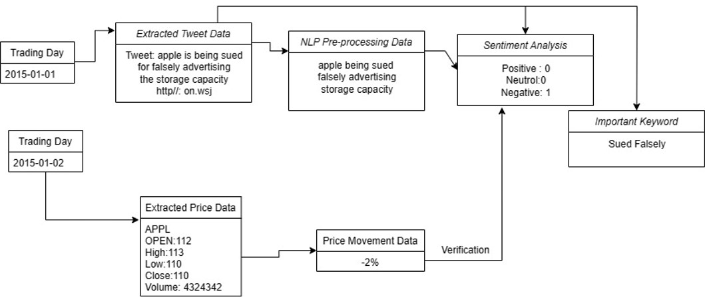

### Pre-processing of Text

Text preprocessing included steps like tokenization, normalization, and removal of noise to prepare the data for sentiment analysis.
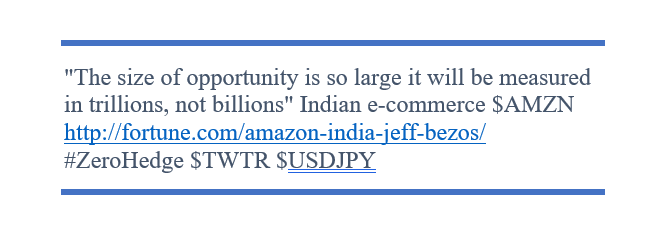

### Sentiment Analysis of Tweets

Tweets were analyzed using the VADER and Fin-BERT models to assign sentiment scores, which were then used to study their impact on stock prices.

## Results

### User Engagement and Price

Graphs depicting the correlation between user engagement (likes, retweets) and stock price changes for each company:
- **Apple**: 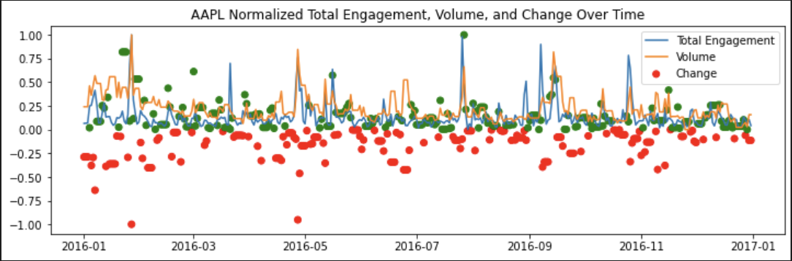
- **Google**: 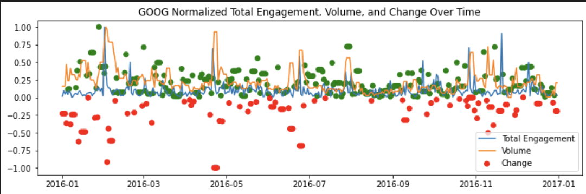
- **Tesla**: 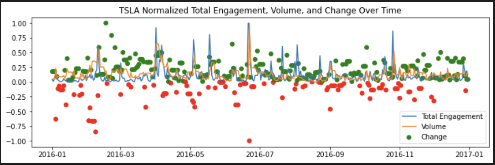
- **Amazon**: 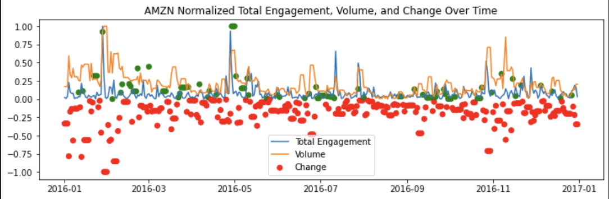
- **Microsoft**: 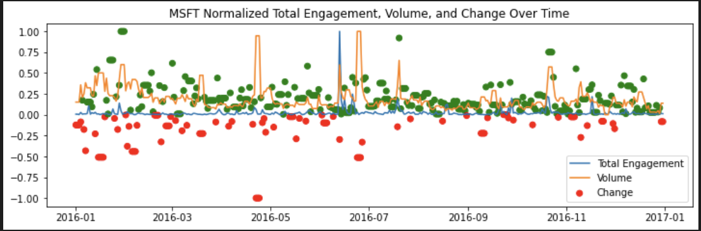

### Follower Count and Price

Correlation graphs showing how the follower count of a company influences its stock price:
- **Apple**: 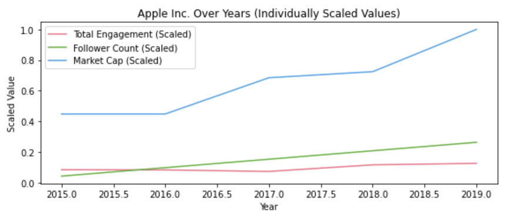
- **Google**: 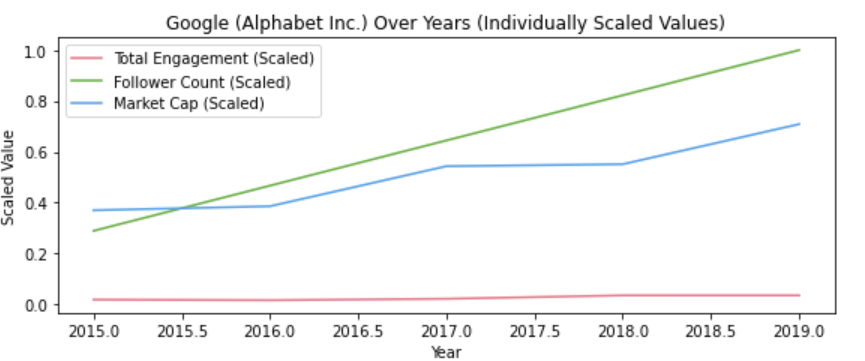
- **Tesla**: 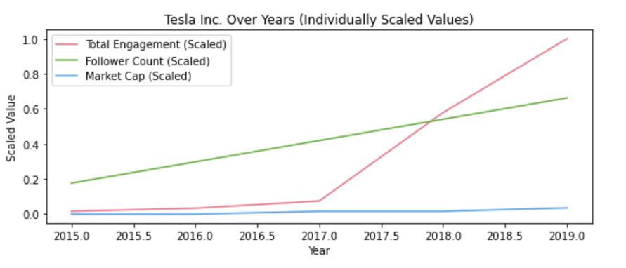
- **Amazon**: 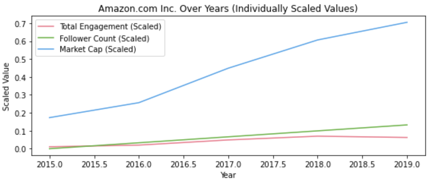
- **Microsoft**: 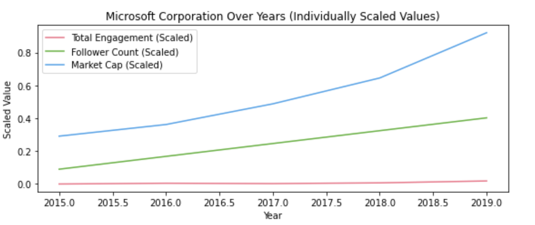

### Accuracy of Sentiment Models

Tables summarizing the accuracy of VADER and Fin-BERT models:
- **VADER Accuracy**: 
- **Fin-BERT Accuracy**: 

### Word Clouds

Visual representation of the most frequently used positive and negative words in tweets for each company:
- **Apple**: 
  - Positive: 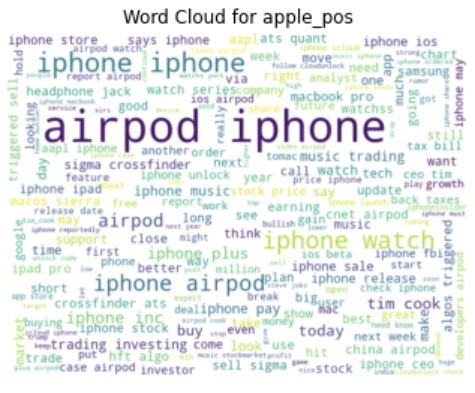
  - Negative: 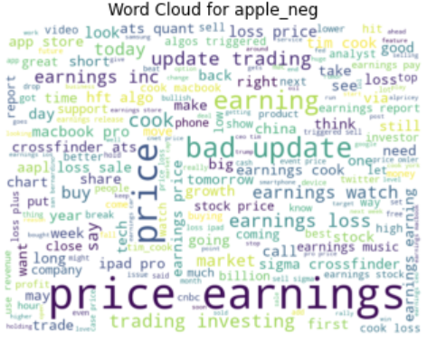
- **Google**:
  - Positive: 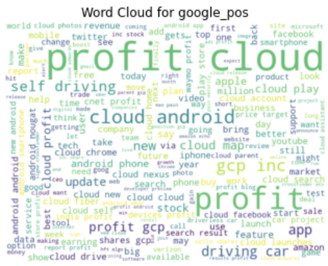
  - Negative: 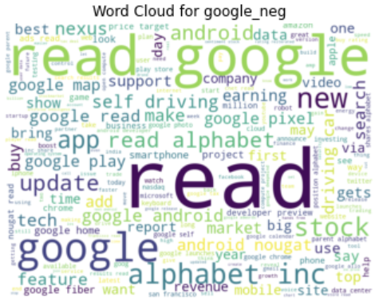
- **Tesla**:
  - Positive: 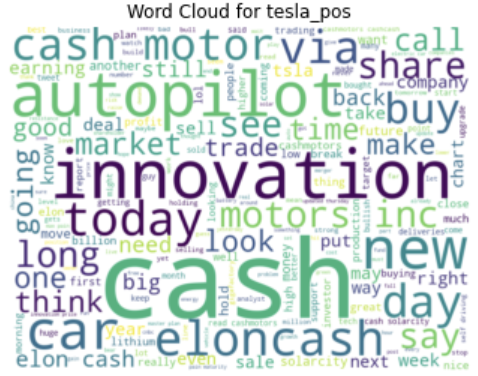
  - Negative: 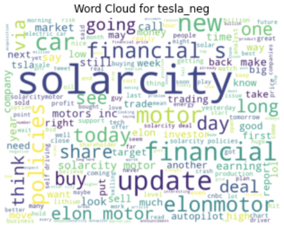
- **Amazon**:
  - Positive: 
  - Negative: 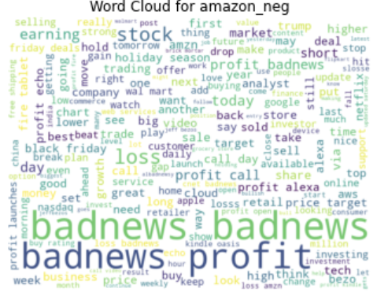
- **Microsoft**:
  - Positive: 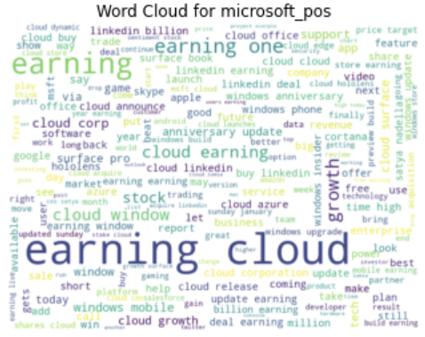
  - Negative: 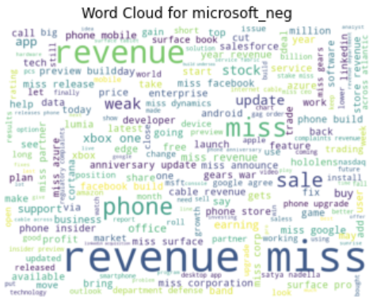

## Conclusion

The findings of this project underscore the substantial impact of social media sentiment on stock prices. Tweets with significant engagement—whether positive or negative—can influence stock prices, highlighting the power of public opinion in the digital age. Our analysis demonstrates that models like VADER and Fin-BERT are effective in predicting stock price movements based on tweet sentiment, offering a novel approach to market analysis.

This study not only validates the influence of Twitter sentiment on stock markets but also opens up new avenues for integrating social media analysis into financial strategies. By understanding and leveraging the sentiment dynamics on social media, investors and analysts can enhance their decision-making processes, potentially leading to more informed and profitable trading strategies. As social media continues to evolve, its role in financial markets is likely to become even more pronounced, making sentiment analysis an indispensable tool for market participants.

