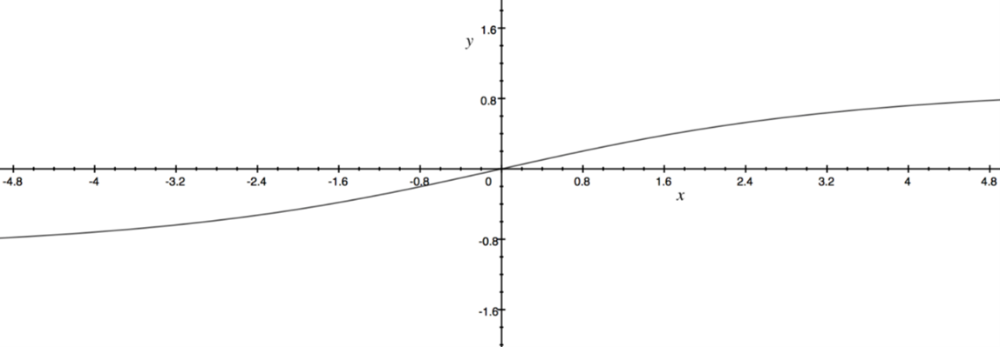
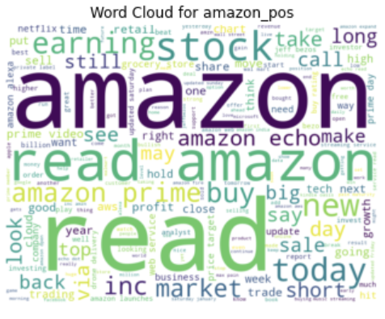

# The Impact of Sentiment on Stock Prices: A Study of Tweets About Top Companies

## Project Overview

This project investigates the impact of social media sentiment, specifically tweets, on the stock prices of major companies. By analyzing the sentiment of tweets using advanced natural language processing (NLP) models, we aim to determine if there is a significant correlation between the sentiment expressed on Twitter and the fluctuations in stock prices.

## Table of Contents

1. [Introduction](#introduction)
2. [Literature Review](#literature-review)
3. [Approach](#approach)
    - [Gathering Information](#gathering-information)
    - [Cleaning the Data](#cleaning-the-data)
    - [Models Used for Sentiment Analysis](#models-used-for-sentiment-analysis)
4. [Implementation](#implementation)
    - [Architecture](#architecture)
    - [Pre-processing of Text](#pre-processing-of-text)
    - [Sentiment Analysis of Tweets](#sentiment-analysis-of-tweets)
5. [Results](#results)
    - [User Engagement and Price](#user-engagement-and-price)
    - [Follower Count and Price](#follower-count-and-price)
    - [Accuracy of Sentiment Models](#accuracy-of-sentiment-models)
    - [Word Clouds](#word-clouds)
6. [Conclusion](#conclusion)

## Introduction

With the rise of social media platforms like Twitter, the exchange of information has accelerated, impacting various domains, including the financial markets. This project explores how sentiments expressed in tweets about top companies can influence their stock prices. The study focuses on companies such as Apple, Google, Tesla, Amazon, and Microsoft.

## Literature Review

Research has shown that social media sentiment can affect stock prices. Studies have used various methods like emotion analysis and sentiment analysis to predict stock movements. These studies highlight the potential of using social media data to gain a competitive edge in stock trading.

## Approach

### Gathering Information

We collected tweets related to the top companies using the Twitter API. The data included tweet content, user engagement metrics (likes, retweets), and follower counts.

### Cleaning the Data

Data cleaning involved removing noise such as spam, non-English tweets, and irrelevant content. Text preprocessing techniques like tokenization, stop-word removal, and lemmatization were applied.

### Models Used for Sentiment Analysis

We utilized two primary models for sentiment analysis:

#### VADER (Valence Aware Dictionary and sEntiment Reasoner)

- **How VADER Works**: VADER is a lexicon and rule-based sentiment analysis tool specifically attuned to sentiments expressed in social media.
- **VADER Sentiment Score Graph**: 

#### Fin-BERT

- **How Fin-BERT Works**: Fin-BERT is a domain-specific BERT model pre-trained on financial text for sentiment analysis.
- **Fin-BERT Model Diagram**: 
- **Comparison with Other Models**: 

### Calculating Percentage Change in Stock Price

The percentage change in stock price was calculated using historical stock price data and correlated with the sentiment scores derived from the tweets.

## Implementation

### Architecture

The project architecture involves data collection, preprocessing, sentiment analysis, and correlation analysis. 

### Pre-processing of Text

Text preprocessing included steps like tokenization, normalization, and removal of noise to prepare the data for sentiment analysis.

### Sentiment Analysis of Tweets

Tweets were analyzed using the VADER and Fin-BERT models to assign sentiment scores, which were then used to study their impact on stock prices.

## Results

### User Engagement and Price

Graphs depicting the correlation between user engagement (likes, retweets) and stock price changes for each company:
- **Apple**: 
- **Google**: 
- **Tesla**: 
- **Amazon**: 
- **Microsoft**: 

### Follower Count and Price

Correlation graphs showing how the follower count of a company influences its stock price:
- **Apple**: 
- **Google**: 
- **Tesla**: 
- **Amazon**: 
- **Microsoft**: 

### Accuracy of Sentiment Models

Tables summarizing the accuracy of VADER and Fin-BERT models:
- **VADER Accuracy**: 
- **Fin-BERT Accuracy**: 

### Word Clouds

Visual representation of the most frequently used positive and negative words in tweets for each company:
- **Apple**: 
  - Positive: 
  - Negative: 
- **Google**:
  - Positive: 
  - Negative: 
- **Tesla**:
  - Positive: 
  - Negative: 
- **Amazon**:
  - Positive: 
  - Negative: 
- **Microsoft**:
  - Positive: 
  - Negative: 

## Conclusion

The study concludes that there is a noticeable impact of social media sentiment on stock prices. Tweets with significant engagement can influence stock prices, especially when the sentiment is highly positive or negative. The accuracy of sentiment models like VADER and Fin-BERT in predicting stock price movements indicates the potential of integrating social media analysis into trading strategies.

---

This README provides a comprehensive overview of your project and is structured to guide readers through each component of your research and findings.
